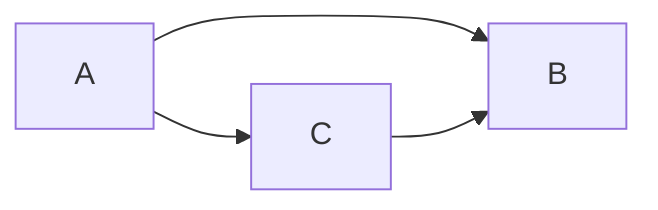
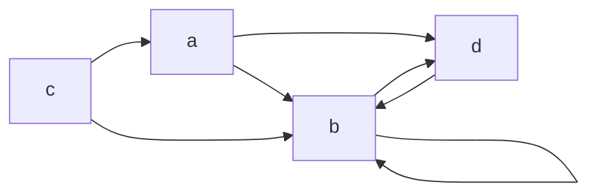
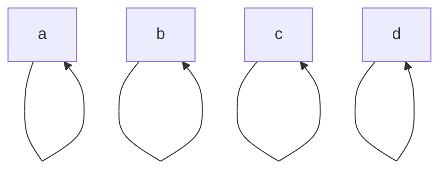
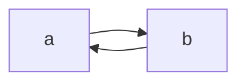
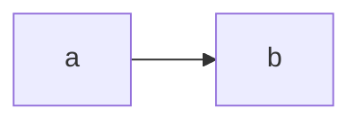
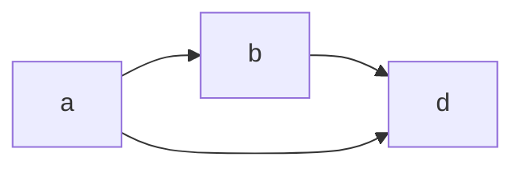

---
cssclasses:
  - center-images
  - center-titles
  - page-black
  - pen-white
date: 2024-09-24
---
2024-10-12

# Relations

Topics
1. Relations and Their Properites
2. n-ary
3. Representing Relations
4. Closures of Relations

# Relations and Their Properties
## Binary Relations
เซ็ต 2 เซ็ตทำผลคูณ Catesian $R \subseteq A \times B$

## Relations on A set
A ไป A

$$
\begin{align}
A & =\{ 1,2,3,4 \} \\
R & =\{ (a,b)|a \text{ divides }b \} \\
R  & = \{ (1,1),(1,2),(1,3),(1,4),(2,2),(2,4),(3,3),(4,4) \}
\end{align}
$$

## Relations on a Set (count)
### A ไป A มีกี่ n ความสัมพันธ์?

### ex. จากความสัมพันธ์่ต่อไปนี้ ตรวจสอบ

![[Pasted image 20241012111901.png]]

$$
\begin{align}
R_{1} & =\{ (1,1),(1,2) \} \\
R_{2} & = \{ (2,1), (1,-1) \}\\
R_{3} & = \{ (1,1), (1,-1) \} \\
R_{4} & = \{ (1,1) \}\\
R_{5} & = \{ (2,1) \}\\
R_{6} & = \{ (1,1),(1,2),(2,1),(1,-1) \}
\end{align}
$$

## Reflexive Relations
R เป็น reflexive $\to$ $(a,a) \in R$ เมื่อทุกๆ $a \in A$ 
R คือ $A \times A$
$$
\forall x[x\in U \to(x,x)\in R]
$$
### ex. A และ R
$$
\begin{align}
A & =\{ 1,2,3 \} \\
R & =\{ (1,1),(2,2),(3,3) \}
\end{align}
$$
ตัวหน้ากับหลังต้องเหมือนกัน และ $R \in A$

### จากโจทย์หา Reflexive
![[Pasted image 20241012112652.png]]

$$
\begin{align}
R_{1} & = \text{เป็น} \\
R_{2} & = \\
R_{3} & = \text{เป็น} \\
R_{4} & = \text{เป็น} \\
R_{5} & = \\
R_{6} & =
\end{align}
$$
## Symmetric Relations

สมมาตร $(b,a)\in R \implies (a,b)\in R$
$$
\forall x\forall y[(x,y) \in R \to (y,x) \in R]
$$

### ex. A และ R
$$
\begin{align} \\
A & = (1,2)\\
R & =\{ (1,2),(2,1) \}
\end{align}
$$

### จากโจทย์หา symmetric (โจทย์อันเดียวกับ Reflexive)
![[Pasted image 20241012112652.png]]

$$
\begin{align}
R_{1} & = \\
R_{2} & = \\
R_{3} & = \text{เป็น} \\
R_{4} & = \text{เป็น} \\
R_{5} & = \\
R_{6} & = \text{เป็น}  & 2+1\leq 3 \text{ และ } 1+2\leq 3
\end{align}
$$

## Antisymmetric
$$
\forall x\forall y[(x,y) \in R \wedge (y,x) \in R \to x=y]
$$
แต่ x=y เป็นข้อยกเว้นทำให้เป็น antisymmetric
$(1,2) \in R$ ต้องไม่มี $(2,1) \in R$
ต้องไม่มีการกลับกับเลยในความสัมพันธ์ ส่วนใหญ่ symmetric ไม่เป็น Antisymmetric

### Ex. จากโจทย์หา antisymmetric
![[Pasted image 20241012112652.png]]
$$
\begin{align}
R_{1} & = \text{เป็น} \\
R_{2} & = \text{เป็น} \\
R_{3} & = (1,-1) \text{ และ } (-1,1)\\
R_{4} & = \text{เป็น} \\
R_{5} & = \text{เป็น} \\
R_{6} & = 1+2\leq 3 \text{ และ } 2+1 \leq 3
\end{align}
$$

## Transitive 
$$
\forall x\forall y\forall z[(x,y)\in R\wedge(y,z)\in R\to(x,z)\in R]
$$
คือ การถ่ายทอด ถ้ามี x,y y,z แล้ว ต้องมี y,z

### Ex. A และ R
$$
\begin{align}
A & =\{ 1,2 \} \\
R & = \{ (1,2),(2,1),(1,1),(2,2) \}
\end{align}
$$

### Ex. จากโจทย์หา Transitive
![[Pasted image 20241012112652.png]]
$$
\begin{align}
R_{1} & = \text{เป็น } a\leq b,b\leq c \to a\leq c \\
R_{2} & = \text{เป็น } a > b,b > c \to a > c \\
R_{3} & = \text{เป็น } (1,-1), (-1,1) \to (1,1), (-1,-1)\\
R_{4} & = \text{เป็น มีทุกสมบัติ} a = b,b = c \to a = c \\
R_{5} & = (4,3),(3,2) \to (4,2) \not\in R\\
R_{6} & = (2,1),(1,2) \to (2,2) \not\in R
\end{align}
$$

# n-ary Relation

เกิดจาก $R \subset nSet$ เมื่อ $A_{1},A_{2},\dots ,A_{n}$ เป็น domain subset เป็น degree หรือเรียกว่า tuples

## ex. 5-tuples (A,N,S,D,T)

![[Pasted image 20241012115231.png]]

- (Nadir, 963, Newark, Bangor, 15:00) $\in R$
- Degree 5

## Database and Relations

เมื่อเรามี list ของ tuples เยอะๆจะได้ database
- relational data model
- 1 tuples คือ 1 records
- relations คือ table
- column แต่ล่ะอันคือ attribute
- primary key คือ domain ที่ไม่ซ้ำกันเลย

### Ex. a database of student

![[Pasted image 20241012115603.png]]

$D=\{ (S,ID,M,GPA) \}$

## Database and Relations 2

- Cartesian product of domains ได้ composite key

### Ex. Major + GPA ได้ composite key เมื่อไม่มีเพิ่มแล้ว

![[Pasted image 20241012115603.png]]

- ถ้าไม่มีเพิ่มทำได้
- แต่ถ้ามีเยอะขึ้จะเอามาใช้ไม่ได้แน่นอน

## Selection operator $S_{c}$

sql select ทั่วไป

![[Pasted image 20241012115603.png]]

### Ex. C1 เมื่อ Major = “Computer Science”
→ Ackermann 231455 Computer Science 3.88
→ Chou 102147 Computer Science 3.49

### Ex. C2 GPA > 3.5

→ Ackermann 231455 Computer Science 3.88
→ Rao 678543 Mathematics 3.90

### Ex. GPA > 3.5 และ GPA > 3.5

→ Ackermann 231455 Computer Science 3.88

## Projection

มีตาราง ต้องการลด column ลง เลือก column

![[Pasted image 20241012120623.png]]

### Ex. P1,2

![[Pasted image 20241012120648.png]]

## Join operator

join ตาราง $J_{p}(R,S)$

### Ex. เชื่อม J2

![[Pasted image 20241012120827.png]]

![[Pasted image 20241012120850.png]]

# Representing Relation

เมื่อ $A=\{ a_{1},a_{2},\dots ,a_{n} \}$ และ $B=\{ b_{1},b_{2},\dots ,b_{n} \}$

## Matrices
- คู่อันดับ 2d ใช้ matrices

$$
m_{ij}=
\begin{cases}
1 & \text{if } (a_{i},b_{j}) \in R\\
0 & \text{if } (a_{i},b_{j}) \not\in R\\
\end{cases}
$$
### Ex. จาก A, B

![[Pasted image 20241012121532.png]]

$$
\begin{align}
R & ={(2,1),(3,1),(3,2)} \\
\end{align}
$$
$$
M_{R}=
\begin{bmatrix}{}
0 & 0 \\
1 & 0 \\
1 & 1
\end{bmatrix}
$$

- ข้อเสียถ้ามันมีเยอะมากๆจะไม่เหมาะเลย

### Ex. matrices → sets

![[Pasted image 20241012122109.png]]
$$
R=\{ (a_{1},b_{2}),(a_{2},b_{1}),(a_{2},b_{3}),(a_{2},b_{4}),(a_{3},b_{1}),(a_{3},b_{3}),(a_{3},b_{5}) \}
$$

### Matrices and Properties

$M_{n,n}$ = 1
![[Pasted image 20241012122236.png]]

Symmetric $M_{i,j}=M_{j,i}$
Antisymmetric $M_{i,j}=1 \to M_{j,i}=0$
![[Pasted image 20241012122243.png]]

#### Ex. 3 จาก matrices
$$
M_{r}=
\begin{bmatrix}
1 & 1 & 0 \\
1 & 1 & 1 \\
0 & 1 & 1
\end{bmatrix}
$$
- Reflexive
- Symmetric

## Digraphs

A node and vertices together

### Ex. (a,b),(a,d),(b,b),(b,d),(c,a),(c,b) and (d,b)

### Ex. ย้อน

![[Pasted image 20241012123434.png]]
$$
R=\{ (1,2),(1,4),(2,2),(2,1),(2,3),(3,1),(3,3),(4,1),(4,3) \}
$$

### Properties
- Reflexivity: จะมี loop ในทุกจุดยอด

- Symmetry: มีเส้นไปกลับทุกอัน

- Antisymmetry: มีแค่ไปไม่มีกลับทุกอัน

- Transitivity: 

#### Ex. จากกราฟ

![[Pasted image 20241012123955.png]]

| props | s1  | s2  |
| ----- | --- | --- |
| r     | ✅   | ❌   |
| s     | ❌   | ✅   |
| as    | ❌   | ❌   |
| t     | ❌   | ❌   |

# Closures of Relations

## Different types of Closures
ไม่มีสมบัติบาง อย่าง เราต้องคู่อันดับน้อยที่สุดเพื่อให้ได้สมบัตินั้นๆ

## Ex. Reflexive Closure

$R = \{ (a,b) | a<b \} \in I$

ต้องการเงื่อนไขที่ $a=b$
กำหนดให้
$$
\Delta=\{ (a,a), a\in Z \}
$$
Reflexive Closure ของ R คือ
$$
\begin{align}
R \cup \Delta = &  \{ (a,b)|a<b \}\cup \{ (a,a)|a\in Z \} \\
= & \{ (a,b)|a\leq b \}\
\end{align}
$$
## Ex. Symmetric Closure

$R^{-1} = \{ (a,b) | a>b \} \in I^+$
$$
\begin{align}
R\cup R^{-1} & =\{ (a,b)|a>b \} \cup \{ (b,a)|a>b \} \\
 & = \{ (a,b)|a\neq b \}
\end{align}
$$

## Paths in Directed Graphs

คือเส้นทางเดินประกอบไปด้วย
- sequence of edges $(x_{0},x_{1}),(x_{1},x_{2}),(x_{2},x_{3}),\dots (x_{n-1},x_{n})$
	- เริ่ม $x_{0}$ จบ $x_{n}$
	- path หน้า ตามด้วย path หลัง
- มี $x_{0},x_{1},x_{2},\dots,x_{{n-1}}$
- a to a จะเป็นความยาวเป็น 0
- length คือ n of sequence of edges
- circuit คือวนกลับมายัง ตัวเริ่ม
- มี edges ซ้ำกันได้

### Ex. เส้นทางเดิน

![[Pasted image 20241012150548.png]]

1. a,b,e,d ไปได้
2. a,e,c,d,b
3. b,a,c,b,a,a,b เป็น เป็น circuit

## Paths in Directed Graphs 2
### Theorem 1
R เป็นความสัมพันธ์แล้ว จะมีความยาว n จาก a ไป b ถ้า $(a,b) \in R^n$

## Connectivity Relation
Definition: ความสัมพันธ์แล้ว เมื่อ a→b จะมีเส้นทางอื่นๆอีกจาก a→b
### Ex. มีความสัมพันธ์ของคนทั้งโลกแล้ว
$R^n$ คืออะไร $R^*$ คืออะไร?

$$
\begin{align}
R^2  & ; a\to b: \to (a,c),(c,b) \\
R^3 & ;a\to b:(a,c),(c,d),(d,b) \\
R^n & ; (a,x_{1}),(x_{1},x_{2}),(x_{2},x_{3}),\dots,(x_{n-1},b) \\
 \\
R^* & ;(a,b)\in X
\end{align}
$$
มี path $a,x_{1},x_{2},x_{3},\dots,x_{n-1}b$

## Transitive Closures
### Theorem 2
คือ connectivity relation

### Theorem 3
ถ้าต้องการสร้างโดย
$$
M_{R^*}=M_{R}\vee M_{R}^{[2]}\vee M_{R}^{[3]}\vee\dots \vee\vee M_{R}^{[n]}
$$

### Algorithms
![[Pasted image 20241012151905.png]]

#### Boolean product
$$
A=
\begin{bmatrix}
1 & 0 \\
0 & 1
\end{bmatrix},
B=\begin{bmatrix}
1 & 1 \\
0 & 1
\end{bmatrix}
$$
$$
A \odot B =
\begin{bmatrix}
(1\wedge1)\vee(0\wedge0) & (1\vee 1) \vee(0 \wedge 1) \\
(0\vee 1)\vee(1\wedge 0) & (0\wedge 1)\vee(1\wedge 1)
\end{bmatrix}
$$

### Ex. Find the zero-one matrix
$$
M_{R}=
\begin{bmatrix}
1 & 0 & 1 \\
0 & 1 & 0 \\
1 & 1 & 0
\end{bmatrix}
$$
Solution $M_{R^*}=M_{R}\vee M_{R}^{[2]}\vee M_{R}^{[3]}$

$$
M_{R}^{[2]}=
\begin{bmatrix}
1 & 1 & 1  \\
0 & 1 & 0 \\
1 & 1 & 1
\end{bmatrix}
$$

$$
M_{R}^{[3]}=
\begin{bmatrix}
1 & 1 & 1  \\
0 & 1 & 0 \\
1 & 1 & 1
\end{bmatrix}
$$

$$
M_{R^*}=\begin{bmatrix}
1 & 0 & 1 \\
0 & 1 & 0 \\
1 & 1 & 0
\end{bmatrix}\vee \begin{bmatrix}
1 & 1 & 1  \\
0 & 1 & 0 \\
1 & 1 & 1
\end{bmatrix}\vee \begin{bmatrix}
1 & 1 & 1  \\
0 & 1 & 0 \\
1 & 1 & 1
\end{bmatrix}
=
\begin{bmatrix}
1 & 1 & 1  \\
0 & 1 & 0 \\
1 & 1 & 1
\end{bmatrix}
$$
### Warshall’s Algorithm
### Ex. use Warshall’s Algorithm
![[Pasted image 20241012152657.png]]

![[Pasted image 20241012152806.png]]
ดูว่าตำแหน่งไหนมี 1 บ้่้าง คือ col 4 row 2,3 ขีดเส้นสร้างจัดตัด
![[Pasted image 20241012152848.png]]
ต้องไหนมีจุดตัดเป็น 1 จะได้ $W_{1}$
![[Pasted image 20241012152907.png]]
![[Pasted image 20241012153030.png]]
![[Pasted image 20241012153037.png]]
![[Pasted image 20241012153108.png]]
![[Pasted image 20241012153142.png]]
![[Pasted image 20241012153147.png]]
