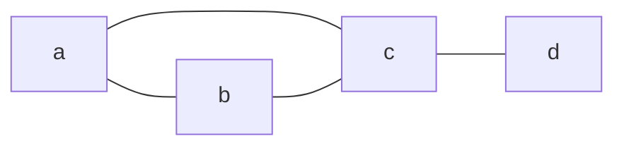
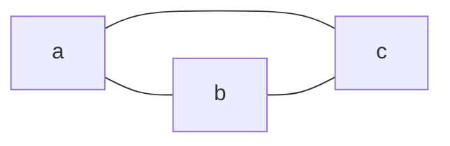
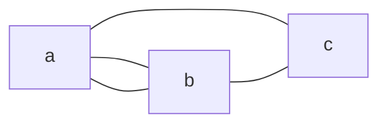
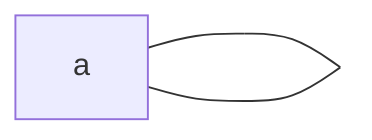
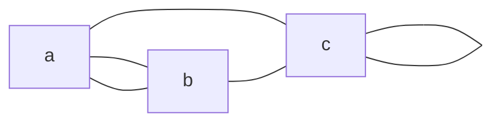
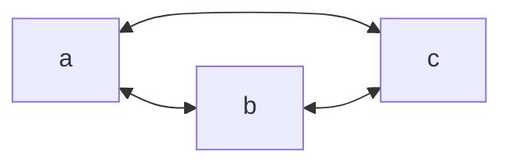
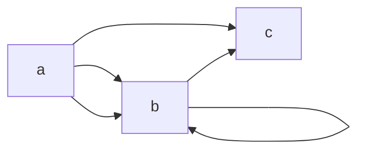
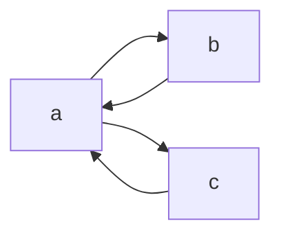

---
cssclasses:
  - center-images
  - center-titles
  - page-black
  - pen-white
date: 2024-09-24
---
2024-10-30

# Graphs

1. Graphs and Graph Models
2. Graph Terminology and Special Types of Graphs
3. Representing Graphs and Graph Isomorphism
4. Euler and Hamilton Paths
5. Shortest-Path Problems

# Graphs and Graph Models

## Undirected Graph

$G=(V,E)$ of set $V$ and set $E$

### Example.

$$
\begin{align}
V & ={a,b,c,d} \\
E & = \{ (a,b),(a,c),(b,c),(c,d) \}
\end{align}
$$

### Terminology

- Simple Graph ไม่มี edge ซ้ำ

- Multiple Graph มีการซ้ำ

- Loop โยงตัวมันเอง

- Circuit จุดต้นจุดปลายจุดเดียวกัน
- Pseudograph คือ ผลรวมของ Multigraphs + Loop

## Directed Graph

undirected graph : u, v → terminal
directed graph: u → start, v → end

**Remark** : Order is key to prove, with order is directed ไม่มีคือ undirected

### Directed Graph Terminology

Simple : 

Multiple (Allow Loop) : 

# Terminology

## Undirected Graph
### Adjacent (or neighbors)

คือ set ของ node ที่เชื่อมกัน จากจุดหนึ่งไปยังจุดหนึ่ง

### Neighborhood
คือ set ของ vertex

### Example 1.

![[Pasted image 20241030135827.png]]

$$
\begin{align}
deg(a)=2 &  & N(a)= \{ b,f \} \\
deg(b)=4 &  & N(b)=\{ a,c,e,f \} \\
deg(c)=4 &  & N(c)=\{ b,d,e,f \} \\
deg(d)=1 &  & N(d)=\{ c \} \\
deg(e)=3 &  & N(e)=\{ b,c,f \} \\
deg(g)=0 &  & N(g)=\phi
\end{align}
$$

### Example 2.

![[Pasted image 20241030140049.png]]

$$
\begin{align}
deg(a)=4 &  & \{ b,d,e \} \\
deg(b)=6 &  & \{ a,b,c,d,e \} \\
deg(c)=1 &  & \{ b \} \\
deg(d)=1 &  & \{ a,b,e \} \\
deg(e)=6 &  & \{ a,b,d \} \\
\end{align}
$$

### Degrees of Vertices
#### Handshaking theorem
ถ้า $G=(V,E)$ เป็น undirected graph ที่มี m edges แล้ว
$$
2m=\sum_{v\in V} deg(v)
$$
##### Example 1.

จาก Handshaking theorem

$$
\begin{align}
2m & =10(6) &  \\
m & =30 \\
\end{align}
$$
$\therefore \text{edges  = }30$

##### Example 2.

$$
\begin{align}
2m & =5(3) \\
m & =7.5 \text{ false}
\end{align}
$$
$m\neq 7.5$ เนื่องจาก $m\in Z^+$
**แสดงให้เห็นว่า ต้องเป็นจำนวนคู่เท่านั้น**

#### 2. Thorem

จำนวน vertices ที่มี degree เป็นคี่จะเป็นจำนวนคู่
graph จะสร้าง verticles ที่เป็นคี่หรือทำให้ผลรวมของ degree เป็นคี่เสมอๆ

## Directed Graphs

in-degree $deg^-(v)$
out-degree $deg^+(v)$

![[Pasted image 20241030141642.png]]

$$
\begin{align}
deg(a)^-=4 &  & deg(a)^+=4 \\
deg(b)^-=6 &  & deg(b)^+=6 \\
deg(c)^-=1 &  & deg(c)^+=1 \\
deg(d)^-=1 &  & deg(d)^+=1 \\
deg(e)^-=6 &  & deg(e)^+=6 \\
\end{align}
$$

### Thorem
$$
|E|=\sum_{v\in V} deg^-(V) =\sum_{v\in V} deg^+(V)
$$

## Types of Graph
### Completed Graph

![[Pasted image 20241030142040.png]]

### Cycles

![[Pasted image 20241030142118.png]]

### Wheels

![[Pasted image 20241030142138.png]]

### n-Cubes

![[Pasted image 20241030142204.png]]

### Bipartite

กราฟที่สามารถแบ่งเป็นได้ 2 กลุ่ม

![[Pasted image 20241030142831.png]]

#### Complete Bipartite Graphs

Vertices ของกลุ่มหนึ่งโยงไปหาอีกกลุ่มหนึ่ง

![[Pasted image 20241030143359.png]]

# Representing of Graph

## Adjacency Lists
### Example

![[Pasted image 20241030144730.png]]

| vertex | Adjacent Vertices |
| ------ | ----------------- |
| a      | b,c,e             |
| b      | a                 |
| c      | a,d,e             |
| d      | c,e               |
| e      | a,c,d             |

## Incidence Matrices

![[Pasted image 20241030145918.png]]

$$
\Bigg[
\begin{matrix}
1 & 1 & 0 & 0 & 0 & 0 \\
0 & 0 & 1 & 1 & 0 & 1 \\
0 & 0 & 0 & 0 & 1 & 1 \\
1 & 0 & 1 & 0 & 0 & 0 \\
0 & 1 & 0 & 1 & 1 & 0
\end{matrix}
\bigg]
$$

![[Pasted image 20241030150509.png]]

$$
\bigg[
\begin{matrix}
1 & 1 & 1 & 0 & 0 & 0 & 0 & 0 \\
0 & 1 & 1 & 1 & 0 & 1 & 1 & 0 \\
0 & 0 & 0 & 1 & 1 & 0 & 0 & 0 \\
0 & 0 & 0 & 0 & 0 & 0 & 1 & 1 \\
0 & 0 & 0 & 0 & 1 & 1 & 1 & 1
\end{matrix}
\bigg]
$$

## Isomorphism of Graphs

### Example 1.
![[Pasted image 20241030150651.png]]

degree เท่ากันหมด
เอา degree เท่ากันมาจับกัน

u1 จับ v1
u2 จับ v3
u3 จับ v4
u4 จับ v2

$$
\begin{align}
f(u_{1}) & =v_{1} \\
f(u_{2}) & =v_{2} \\
f(u_{3}) & =v_{3} \\
f(u_{4}) & =v_{4} \\

\end{align}
$$

### Example 2.

![[Pasted image 20241030151104.png]]

| Vertices G | Amout | Vertices H | Amount |
| ---------- | ----- | ---------- | ------ |
| a          | 2     | s          | 3      |
| b          | 3     | t          | 2      |
| c          | 2     | u          | 2      |
| d          | 3     | v          | 3      |
| e          | 2     | w          | 3      |
| f          | 3     | x          | 2      |
| g          | 2     | y          | 2      |
| h          | 3     | z          | 3      |

ไม่มีสามารถจับคู่ a กับ vertices ใน H ได้

### Example 3.

![[Pasted image 20241030151533.png]]

| Vertices G | Amout | Vertices H | Amount |
| ---------- | ----- | ---------- | ------ |
| u1         | 2     | v1         | 2      |
| u2         | 3     | v2         | 2      |
| u3         | 2     | v3         | 3      |
| u4         | 3     | v4         | 2      |
| u5         | 2     | v5         | 3      |
| u6         | 2     | v6         | 2      |

$$
\begin{align}
f(u_{1}) & =v_{1} \\
f(u_{2}) & =v_{2} \\
f(u_{3}) & =v_{3} \\
f(u_{4}) & =v_{4} \\
f(u_{5}) & =v_{5} \\
f(u_{6}) & =v_{6}

\end{align}
$$

# Euler and Hamilton Paths

Paths : จุดต้น และ จุดปลายต่างกัน
Circuits : จุดต้น และ จุดปลายเหมือนกัน

## Euler

![[Pasted image 20241030152334.png]]

* เดินทุกสะพานโดยเดินลงแผ่นดินแต่ล่ะอันแค่ครั้งเดียว

### Euler circuit

Simple Circuit w/ every edge of G

![[Pasted image 20241030152923.png]]

$G_{1}$ เป็น Euler circuit
$G_{2}$ ไม่เป็น
$G_{3}$ เป็น Euler path

### Necessary Conditions for Euler

- circuit $deg(a)$ ต้องเป็น จำนวนคู่
- path ต้องมี $deg(a)$ ที่เป็นคี่มีได้แค่ 2

#### Example 1.

![[Pasted image 20241030153531.png]]

$G_{1}$ เป็น Euler path d,a,b,c,d,b
$G_{2}$ เป็น Euler path b,a,g,f,e,d,c,g,b,c,f,d
$G_{3}$ ไม่เป็น Euler path

# Hamilton

Vertices ครบทุกครั้งโดยแต่ล่ะอันใช้ได้ครั้งเดียว

## Hamilton Paths and Circuits
### Example 1.
![[Pasted image 20241030154025.png]]

$G_{1}$ เป็น circuit a,b,c,d,e,a
$G_{2}$ เป็น path a,b,d,c
$G_{3}$ ไม่เป็น

### Dirac’s Theorem

If every vertex in $G$ has $degree ≥\frac{n}{2}$, then $G$ has a Hamiltonian cycle.

### Ore’s Theorem

$n\geq3$ verticles แล้ว ทุกๆ $deg(u)+deg(v) \geq n$
