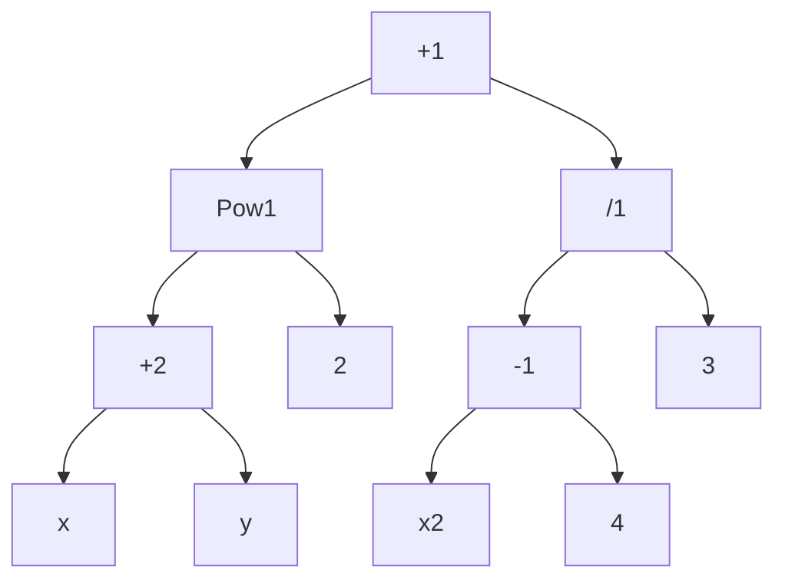

---
cssclasses:
  - center-images
  - center-titles
  - page-black
  - pen-white
date: 2024-09-24
---
2024-11-13 Trees

# Trees

1. Introduction to Trees
2. Tree Traversal
	1. Insert
	2. Transverse
	3. Delete
3. Spanning Trees
	1. Graphs to Trees

# Introduction to Trees.

## Definition
undirected graph ที่ไม่เป็น circuits.

![[Pasted image 20241113135111.png]]

Tree: $G_{1}, G_{2}$
Non-Tree: $G_{3},G_{4}$

## Rooted Trees.
with one vertex dedicated to be a roots
![[Pasted image 20241113140348.png]]

## Tree Terminology

- V Vertex
- Ancestors คือ vertex ที่เข้ามา
- Descendants คือ vertex ที่ออกไป
- Leaf คือไม่มี Descendants
- Verticals มี Vertex คือ Internal Vertices
- Subtrees คือ Sub graphs
- Siblings คือ มีพ่อแม่คนเดียวกัน

### Example 1.

![[Pasted image 20241113141102.png]]

1. parent of c is b, children of g are h,i,j sublings of h are i,j, ancestors of e are a,b,c and descendants of b are c,d,e
2. e
	1. internal a,b,c,g,h,j
	2. d,e,f,k,i,l,m

## M-ary Rooted Trees

m-ary tree คือ แต่ล่ะ vertex มีลูกแค่ M
2-ary tree เรียก binary trees

### Example 2.

![[Pasted image 20241113141900.png]]

1. bi
2. 3-ary
3. 5-ary
4. is not 2,2,3

## Ordered Trees

มีการนับซ้ายไปขวา หรือ ขวาไปซ้าย

## Properties of Tree

### Tree มี n Vertices จะมี n-1 Edges.
### I internval vertices จะมี vertices ทั้งหมด n=mi+1

## Balance Tree
leafs are on h or h-1 only

![[Pasted image 20241113143317.png]]

Balanced: $T_{1}, T_{3}$
UnBalanced: $T_{2}$

# Tree Traversal

- Preorder, Inorder and Postorder
- root, left and right

## Preorder Traversal

Root, Left, Right

![[Pasted image 20241113145311.png]]

### Example 3.
![[Pasted image 20241113145346.png]]

a, b, e, j, k, n, o, p, f, c, d, g, l, m, h, i

### Example 4.

![[Pasted image 20241113145500.png]]

## Inorder Traversal

Left, Root, Right

### Example 5.

![[Pasted image 20241113145841.png]]

j, e, n, k, o, p, b, f, a, c, l, g, m, d, h, i

### Example 6.

![[Pasted image 20241113150157.png]]

## Postorder Traversal

Left Right Root

![[Pasted image 20241113150559.png]]

j, n, o, p, k, e, f, b, c, l, m, g, h, i, d, a

![[Pasted image 20241113150640.png]]

## Expression Trees

Complex expression represent as ordered rooted trees
สมการแปลงรูปเป็น ordered rooted trees ได้

![[Pasted image 20241113150730.png]]

## Infix Notation

![[Pasted image 20241113151055.png]]
ทำให้ความหมายของวงเล็ปหายไป
(x+y)/(x+3)
x+y/x+3
x+y/x+3

## Prefix Notation

- Preorder 

infix: x+y
prefix: +xy
postfix: xy+

### Example 7.

![[Pasted image 20241113151410.png]]

หาตัวไหนใหญ่สุด

Root Left Right
+^+xy2/-x43

operator number number → calculate

$num_{1},operate,num_{2}$
-x4
/(-x4)3
+xy
pow(+xy)2
$$
\begin{align}
-x4 \\
/(-x4)3 \\
+xy \\
pow(+xy)2 \\
[+pow(+xy)2]+[/(-x4)3]
\end{align}
$$
### Example 8

![[Pasted image 20241113152208.png]]
$$
\begin{align}
*23 \\
-(*23)5 \\
pow23 \\
/(pow23)4 \\
[-(*23)5] + [/(pow23)4]
\end{align}
$$
## Postfix
expression ไปอยูข้างหลัง

Left→Right→Root

xy+2powx4-3/+
$$
num_{1},num_{2},operator \to calculate
$$
$$
num_{1},operate,num_{2}
$$
$$
\begin{align}
xy+ \\
(xy+)2pow \\
x4- \\
(x4-)3/ \\
[(xy+)2pow]+[(x4-)3/]
\end{align}
$$

### Example 9.
![[Pasted image 20241113153736.png]]
$$
\begin{align}
2,3* \\
7(2,3*)- \\
[7(2,3*)-]4pow \\
9,3/ \\
\{[7(2,3*)-]4pow \}[9,3/]
\end{align}
$$

# Spanning Trees

Let $G$ เป็นกราฟ Spanning Tree ของ G เป็น Subgraph ของ G

Graph → Tree
Select Edges

### Example 10.

![[Pasted image 20241113155555.png]]

circuit a → b → f → e → a
e→f→g→e
c→f→g→c

### Example 11.

![[Pasted image 20241113155727.png]]

## DFS

ไปเรื่อยๆจนหาตัวต่อไม่ได้แล้ว
stack เอาไว้ เช็คว่าเรา visited อะไรไปแล้วบ้าง

### Example 12.

![[Pasted image 20241113155932.png]]

f, d, e, c, a, b, g, h, i, k, j
## BFS

First in, First out
FIFO
use Queue

### Example 13.

![[Pasted image 20241113161604.png]]

Root: e b d f i
Root: e

Queue : e, b, d, f, i, a, c, h, g, j, k, l, m