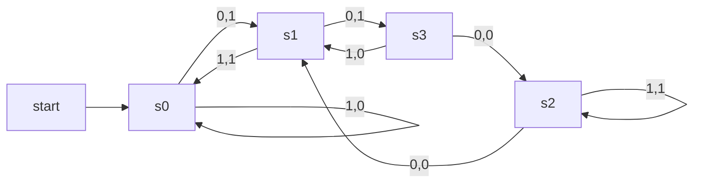

---
cssclasses:
  - center-images
  - center-titles
  - page-black
  - pen-white
date: 2024-09-24
---
2024-11-27 Modeling Computational

# Introduction

- Syntax (form of a sentence)
- Semantics (meaning of sentence)

## Grammar 
- กฏที่ใช้เช็คให้ถูก

Phrase-Structure Grammars
- Vocabulary $V$  
- Word over $V$
- Set of word $V^{\star}$

$$
G=(V,T,S,P)
$$
- Vocabulary V
- T subset V ตัวอักษร ที่เปลี่ยนแปลงไม่ได้
- S ตัวอักษรเริ่ม
- P กฏในการเปลี่ยน

### Example 1.
$$
\begin{align}
V & =\{ a,b,A,B,S \}, \\
T & =\{ a,b \} \\
S & = \text{start symbol} \\
P & = \{ S\to Aba, A\to BB,B\to ab,AB\to b \}
\end{align}
$$
$$
\begin{align}
S & \to Aba \\
 & \to BBba \\
 & \to abBba \\
 & \to ababba
\end{align}
$$

## Derivations
วิธีการสร้างจาก start terminal ให้เป็น string terminal

- เปลี่ยนจาก ซ้ายไปขวา

## Language Generation

### Example 2.

$G$ เป็น Grammar
$V = \{ S,A,a,b \}$
$T = \{ a,b \}$
start symbol $S$,
$P=\{ S\to aA,S\to b,A\to aa \}$

จาก $P$
$$
\begin{align}
S & \to aA \\
 & \to aaa \\
S & \to b
\end{align}
$$
### Example 3.

$G$
$V=\{ S,0,1 \}$
$T=\{ 0,1 \}$
$S$
$P=\{ S\to 11S, S\to0 \}$

$$
\begin{align}
S & \to 0 \\
 & \to 11S \\
 & \to 110 \\
 & \to 11S \\
 & \to 1111S \\
\end{align}
$$
$$
\begin{align}
L(G) & =\{ 0,110,11110,\dots \} \\
 & =\{ 1^n0|n=0,2,4,\dots \}
\end{align}
$$

### Example 4.
ย้อนกลับ

$\{ 0^n,1^n=0,1,2 \}$
$G=\{ V,T,S,P \}$

where
$V={0,1,S}$
$T=\{ 0,1 \}$
$S=\text{start symbol}$
$P=\{ S\to 0S1,S\to \lambda \}$

### Example 5.
$\{ 0^m 1^n|m \}$

$$
\begin{align}
m=0,n=0 & ;S\to \lambda \\
m=1,n=0 & ;S\to 0 \\
m=2,n=0 & ;S\to 00 \\
m=k,n=0 & ;S\to 00\dots0 \to 0k \\
m=k,n=1 & ;S\to 00\dots01 \\
m=k,n=2 & ;S\to 00\dots011 \\
m=k,n=l & ;S\to 00\dots011\dots1 \to 1L
\end{align}
$$

$P=\{ S\to \lambda, S\to 0S, S\to1S \}$

# Finite-State Machines with Output

finite-state machine → มี output
finite automation → ไม่มี output

## Application
- เครื่องกดน้ำ 5,10,25

![[Pasted image 20241127145543.png]]

![[Pasted image 20241127145602.png]]

→ input
← output

## FSMs with outputs.

$M=(S,I,O,f,g,s_{0})$
$S$=input

### Example 6.

$$
\begin{align}
states & : & s0131001 & 3 \\
input & : & 10011100 &  \\
output & : & 01101011 & 
\end{align}
$$

### Example 7.
![[Pasted image 20241127151149.png]]

![[Pasted image 20241127151505.png]]

### Example 8.

![[Pasted image 20241127151525.png]]

input : $x_{1},x_{2}\dots,x_{k}$
output : $0x_{1},x_{2}\dots x_{k-1}$

![[Pasted image 20241127152243.png]]

### Example 9.
![[Pasted image 20241127152309.png]]

![[Pasted image 20241127153402.png]]

# Finite-States Machine without Outputs

FSMs with no output

## Example 10.

![[Pasted image 20241127153953.png]]

## Example 11.

$$
L(M_{1})=\{ 1^n|n=0,1,2,\dots \}
$$

